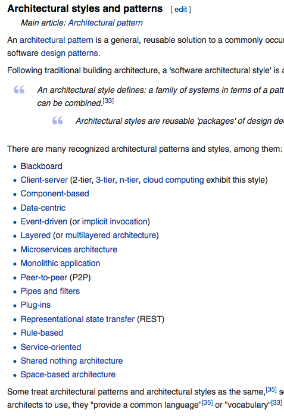

# [fit] **Software**

---
## What **is** Software?

^ Similar to our graduate level understanding of computing hardware, we need to develop a graduate level understanding of computing software.
What is it that makes something software?

---
## Software is an _executable_ process.

^ Specifically executable by a computing machine - the hardware we studied.

---
## Processes **Revisited**

```
                ┌──────────────────────┐
                │                      │
                │                      │
  Input  ──────▶│    Transformation    │───────▶ Output
                │                      │
                │                      │
                └──────────────────────┘
```

---
## Software **Languages**
```
                                ┌───────────────────────────────────────────────────────────────────────────────┐
                                │                                                                               │
                                │                             High Level Languages                              │
                                │                                                                               │
                                └───────────────────────────────────────────────────────────────────────────────┘
                                                    │                                        │
                                                    ▼                                        │
                                ┌──────────────────────────────────────┐                     │
                                │                                      │                     │
                                │          Assembly Language           │                     │
                                │                                      │                     │
                                └──────────────────────────────────────┘                     │
                                                    │                                        │
                                                    ▼                                        ▼
                                ┌───────────────────────────────────────────────────────────────────────────────┐
                                │                                                                               │
                                │                        Machine Code / Machine Language                        │
                                │                                                                               │
                                └───────────────────────────────────────────────────────────────────────────────┘
                                                    │                                        │
                                                    │                                        ▼
                                                    │                    ┌──────────────────────────────────────┐
                                                    │                    │              Micro Code              │
                                                    │                    └──────────────────────────────────────┘
                                                    │                                        │
                                                    ▼                                        ▼
                                ┌───────────────────────────────────────────────────────────────────────────────┐
                                │                                                                               │
                                │                                  {C,G,...}PU                                  │
                                │                                                                               │
                                └───────────────────────────────────────────────────────────────────────────────┘
```

^ Abstraction is the difference.
Assembly/Machine Code - very important in security!

------
# [fit] **High Level**
# [fit] Languages

---
## High level languages offer the _strongest_ **abstraction** from the underlying hardware.

^ Nearly all user-facing software is written at this level. And most of the rest as well.

---
## Common Language Features

| | |
|:---:|:---:|:---:|
| Expressions | Variables |
| Subroutines | Functions |
| Loops | Branching |
| Data Structures | Objects |


---
## Usability **>** Optimality

---
## _Compiled_ vs. _Interpreted_ Languages

| Compiled | Interpreted |
|:---:|:---:|:---:|
| | |

------
# [fit] Major High
# [fit] Level Languages

---
# **Many** Options
### https://en.wikipedia.org/wiki/List_of_programming_languages
### https://www.codingdojo.com/blog/7-most-in-demand-programming-languages-of-2018/

---
## Major Languages

| Language | Applications |
|:---:|---|
| Java | Android Apps, Major EHRs |
| Python | Cutting Edge Machine Learning |
| JavaScript | The Web, Servers |
| C/C++ | Embedded Systems, Highly Optimized Systems |

^ Honorable Mentions: Bash, Swift/Objective-C, Lua

------
# [fit] **Programming** Tips

------
# [fit] **Embedded** Software

---
> __98%__ of all microprocessors are for _embedded systems_
-- Michael Barr [^1]

[^1]: Barr, Michael (1 August 2009). "Real men program in C". Embedded Systems Design. TechInsights (United Business Media). p. 2.

---
| | |
|:---:|:---:|:---:|
| Consumer Electronics | Cooking Equipment |
| Automotive | Industrial Systems |
| Medical Devices | Military |

---
## Embedded Software **Development**
```
┌────────────────────────────────────────────────┐
│                                                │
│                                                │░░
│    ┌───────────────┐      ┌───────────────┐    │░░
│    │  High-Level   │      │   Simulate    │    │░░
│    │   Languages   │─────▶│    & Test     │    │░░                   ┌─────────────────────┐
│    └───────────────┘      └───────────────┘    │░░                   │  ┌───────────────┐  │
│            │                                   │░░                   │  │   Assembled   │  │░░
│            ▼                                   │────────────────────▶│  │    Package    │  │░░
│    ┌───────────────┐      ┌───────────────┐    │░░   Communication   │  └───────────────┘  │░░
│    │    Compile    │      │   Assemble    │    │░░       Link        └─────────────────────┘░░
│    │    & Link     │─────▶│    Package    │    │░░                     ░░░░░░░░░░░░░░░░░░░░░░░
│    └───────────────┘      └───────────────┘    │░░                     ░░░░░░░░░░░░░░░░░░░░░░░
│                                                │░░
│                                                │░░
└────────────────────────────────────────────────┘░░
  ░░░░░░░░░░░░░░░░░░░░░░░░░░░░░░░░░░░░░░░░░░░░░░░░░░
  ░░░░░░░░░░░░░░░░░░░░░░░░░░░░░░░░░░░░░░░░░░░░░░░░░░

                       Host                                                     Target
```

---
## **Challenges** for Embedded Systems


- Limited resources
- Timing constraints
- Debugging without a user interface
- Robustness and longevity requirements

------
# [fit] **Applications**

---
> An application is any program, or group of programs, that is designed for the **end user** ... includ[ing] such things as _database programs_, _word processors_, _Web browsers_ and _spreadsheets_.[^2]

[^2]: Beal, V. (n.d.) Application (Application Software). In webopedia. Retrieved from https://www.webopedia.com/TERM/A/application.html  

---
## **Apps** vs. **Applications**??

^
Potential Distinctions:
Number of functions
Platform
Delivery

---
## Application **Interfaces**

| Command Line | Graphical |
|:---:|:---:|:---:|
| vim | Notepad/TextEdit |
| ls | File Explorer/Finder |
| cURL | Chrome |

^ Maybe do a tour of some of these?

------
# [fit] Software **Systems**

---
## Process : System :: Software : Software System

---
```
           ┌──────────────────────────────────────────────────────────────────────────────────────────────┐
           │                                    ____         __                                           │
           │                                   / __/_ _____ / /____ __ _                                  │
           │                                  _\ \/ // (_-</ __/ -_)  ' \                                 │
           │                                 /___/\_, /___/\__/\__/_/_/_/                                 │
           │                                     /___/                                                    │
           │                                                                                              │
           │                                                 ┌──────────────────────┐                     │
           │                                                 │                      │                     │
           │                                                 │                      │                     │
           │                                     ┌──────────▶│    Transformation    │────────────┐        │
           │                                     │           │                      │            │        │
           │                                     │   Input   │                      │            │        │
           │  ┌──────────────────────┐           │           └──────────────────────┘            │        │
           │  │                      │           │                                               │        │
           │  │                      │   Output  │                                               │        │
Input  ────┼─▶│    Transformation    │───────────┤                                               ├────────┼──▶ Output
           │  │                      │           │                                               │        │
           │  │                      │           │                                               │        │
           │  └──────────────────────┘           │           ┌──────────────────────┐            │        │
           │                                     │   Input   │                      │            │        │
           │                                     │           │                      │            │        │
           │                                     └──────────▶│    Transformation    │────────────┘        │
           │                                                 │                      │                     │
           │                                                 │                      │                     │
           │                                                 └──────────────────────┘                     │
           │                                                                                              │
           └──────────────────────────────────────────────────────────────────────────────────────────────┘
```

---
```
                                     _____       ______
                                    / ___/____  / __/ /__      ______ _________
                                    \__ \/ __ \/ /_/ __/ | /| / / __ `/ ___/ _ \
                                   ___/ / /_/ / __/ /_ | |/ |/ / /_/ / /  /  __/
                                  /____/\____/_/  \__/ |__/|__/\__,_/_/   \___/

                                       _____            __
                                      / ___/__  _______/ /____  ____ ___  _____
                                      \__ \/ / / / ___/ __/ _ \/ __ `__ \/ ___/
                                     ___/ / /_/ (__  ) /_/  __/ / / / / (__  )
                                    /____/\__, /____/\__/\___/_/ /_/ /_/____/
                                         /____/

                          ┌──────────────────────────┐     ┌──────────────────────────┐
                          │                          │░    │                          │░
                          │                          │░    │                          │░
                          │                          │░    │                          │░
                          └──────────────────────────┘░    └──────────────────────────┘░
                           ░░░░░░░░░░░░░░░░░░░░░░░░░░░░     ░░░░░░░░░░░░░░░░░░░░░░░░░░░░


                          ┌──────────────────────────┐     ┌──────────────────────────┐
                          │                          │░    │                          │░
                          │                          │░    │                          │░
                          │                          │░    │                          │░
                          └──────────────────────────┘░    └──────────────────────────┘░
                           ░░░░░░░░░░░░░░░░░░░░░░░░░░░░     ░░░░░░░░░░░░░░░░░░░░░░░░░░░░
```

---
```
                                     _____       ______
                                    / ___/____  / __/ /__      ______ _________
                                    \__ \/ __ \/ /_/ __/ | /| / / __ `/ ___/ _ \
                                   ___/ / /_/ / __/ /_ | |/ |/ / /_/ / /  /  __/
                                  /____/\____/_/  \__/ |__/|__/\__,_/_/   \___/

                                       _____            __
                                      / ___/__  _______/ /____  ____ ___  _____
                                      \__ \/ / / / ___/ __/ _ \/ __ `__ \/ ___/
                                     ___/ / /_/ (__  ) /_/  __/ / / / / (__  )
                                    /____/\__, /____/\__/\___/_/ /_/ /_/____/
                                         /____/

                          ┌──────────────────────────┐     ┌──────────────────────────┐
                          │                          │░    │                          │░
                          │   Complex Applications   │░    │  Numerous Users / Roles  │░
                          │                          │░    │                          │░
                          └──────────────────────────┘░    └──────────────────────────┘░
                           ░░░░░░░░░░░░░░░░░░░░░░░░░░░░     ░░░░░░░░░░░░░░░░░░░░░░░░░░░░


                          ┌──────────────────────────┐     ┌──────────────────────────┐
                          │                          │░    │                          │░
                          │ Distributed / Networked  │░    │   Integrated Functions   │░
                          │                          │░    │                          │░
                          └──────────────────────────┘░    └──────────────────────────┘░
                           ░░░░░░░░░░░░░░░░░░░░░░░░░░░░     ░░░░░░░░░░░░░░░░░░░░░░░░░░░░
```

---
## [fit] Software Systems are _designed_ by Software **Engineers**

------
# [fit] Software **Architectures**

---


---
## Client - Server

```
┌────────────────────────────────────────────────────────────┐
│                                                            │░
│                           Server                           │░
│                                                            │░
└────────────────────────────────────────────────────────────┘░
 ░░░░░░░░░░░░░░░░░░░░░░░░░░░░░░▲░░░░░░░░░░░░░░░░░░░░░░░░░░░░░░░
                               │
              ┌────────────────┴───────────────┐
              │                                │
              ▼                                ▼
┌──────────────────────────┐     ┌──────────────────────────┐
│                          │░    │                          │░
│          Client          │░    │          Client          │░
│                          │░    │                          │░
└──────────────────────────┘░    └──────────────────────────┘░
 ░░░░░░░░░░░░░▲░░░░░░░░░░░░░░     ░░░░░░░░░░░░░▲░░░░░░░░░░░░░░
              │                                │
              ▼                                ▼
┌──────────────────────────┐     ┌──────────────────────────┐
│                          │░    │                          │░
│           User           │░    │           User           │░
│                          │░    │                          │░
└──────────────────────────┘░    └──────────────────────────┘░
 ░░░░░░░░░░░░░░░░░░░░░░░░░░░░     ░░░░░░░░░░░░░░░░░░░░░░░░░░░░
```

---
## Service-Oriented / Microservices

```
                                                                                       ┌──────────────────┐
                                                                                       │                  │░
                                                                              ┌───────▶│  Visit Service   │◀───────┐
                                                                              │        │                  │░       │
                                                                              │        └──────────────────┘░       │
                                                                              │         ░░░░░░░░░▲░░░░░░░░░░       │
                                                                              │                  │                 │
                                                                              │                  │                 │
                                                                              │                  │                 │
                                                                              ▼                  │                 ▼
                                                                    ┌──────────────────┐         │       ┌──────────────────┐
                                                                    │                  │░        │       │                  │░
                                                                    │ Patient Service  │◀────────┼──────▶│ Billing Service  │░
                                                                    │                  │░        │       │                  │░
                                                                    └──────────────────┘░        │       └──────────────────┘░
                                                                     ░░░░░░░░░│░░░░░░░░░░        │        ░░░░░░░░░▲░░░░░░░░░░
                                                                              │                  │                 │
                                                                              │                  │                 │
                                                                              │                  │                 │
                                                                              │                  ▼                 │
                                                                              │        ┌──────────────────┐        │
                                                                              │        │                  │░       │
                                                                              └───────▶│ Provider Service │◀───────┘
                                                                                       │                  │░
                                                                                       └──────────────────┘░
                                                                                        ░░░░░░░░░░░░░░░░░░░░
```

---
## Layered
```
┌──────────────────┐
│                  │░
│   Application    │░
│                  │░
└──────────────────┘░
 ░░░░░░░░░▲░░░░░░░░░░
          ▼
┌──────────────────┐
│                  │░
│    Transport     │░
│                  │░
└──────────────────┘░
 ░░░░░░░░░▲░░░░░░░░░░
          ▼
┌──────────────────┐
│                  │░
│     Network      │░
│                  │░
└──────────────────┘░
 ░░░░░░░░░▲░░░░░░░░░░
          ▼
┌──────────────────┐
│                  │░
│       Link       │░
│                  │░
└──────────────────┘░
 ░░░░░░░░░▲░░░░░░░░░░
          ▼
┌──────────────────┐
│                  │░
│     Physical     │░
│                  │░
└──────────────────┘░
 ░░░░░░░░░░░░░░░░░░░░
```

---
## Model - View - Controller

```
                                                                                      ┌──────────────────┐
                                                                                      │                  │░
                                                                             ┌────────│      Model       │◀───────┐
                                                                             │        │                  │░       │
                                                                             │        └──────────────────┘░       │
                                                                             │         ░░░░░░░░░░░░░░░░░░░░       │ Manipulates
                                                                             │ Updates                            │
                                                                             │                                    │
                                                                             │                                    │
                                                                             ▼                                    ▼
                                                                   ┌──────────────────┐                 ┌──────────────────┐
                                                                   │                  │░                │                  │░
                                                                   │       View       │░                │    Controller    │░
                                                                   │                  │░                │                  │░
                                                                   └──────────────────┘░                └──────────────────┘░
                                                                    ░░░░░░░░░│░░░░░░░░░░                 ░░░░░░░░░▲░░░░░░░░░░
                                                                             │                                    │
                                                                             │                                    │
                                                                             │ Sees                               │ Uses
                                                                             │                                    │
                                                                             │        ┌──────────────────┐        │
                                                                             │        │                  │░       │
                                                                             └───────▶│       User       │────────┘
                                                                                      │                  │░
                                                                                      └──────────────────┘░
                                                                                       ░░░░░░░░░░░░░░░░░░░░
```


------
# [fit] **Operating** Systems
