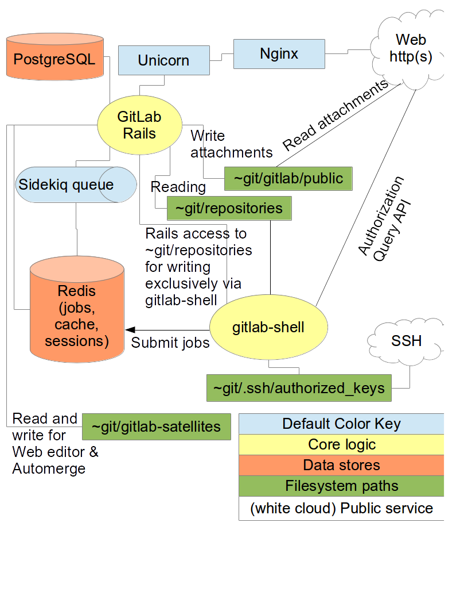

# [fit] **Integrated**
# [fit] IT Systems

---

> Most informatics systems require _integrated_ hardware, software, networking, and web communication.

---



---

```
                                ┌──────────────────────────────────────────────────────────┐
                                │       ______                            __               │
                                │      / ____/___  ____ ___  ____  __  __/ /____  _____    │
                                │     / /   / __ \/ __ `__ \/ __ \/ / / / __/ _ \/ ___/    │
                                │    / /___/ /_/ / / / / / / /_/ / /_/ / /_/  __/ /        │
                                │    \____/\____/_/ /_/ /_/ .___/\__,_/\__/\___/_/         │
                                │                        /_/                               │
                                │                                                          │
                                │                                                          │
                                │        ┌──────────────────────────────────────┐          │
                                │        │                                      │░         │
                                │        │                                      │░         │
                                │        │              Processing              │░         │
                                │        │                                      │░         │
                                │        │                                      │░         │
                                │        └──────────────────────────────────────┘░         │
                                │         ░░░░░░░░░░░░░░░░░░░▲░░░░░░░░░░░░░░░░░░░░         │
                                │                            │                             │
                                │                            ▼                             │
                                │        ┌──────────────────────────────────────┐          │
                                │        │                                      │░         │
                                │        │                                      │░         │
                    Input   ────┼───────▶│               Storage                │──────────┼───▶  Output
                                │        │                                      │░         │
                                │        │                                      │░         │
                                │        └──────────────────────────────────────┘░         │
                                │         ░░░░░░░░░░░░░░░░░░░░░░░░░░░░░░░░░░░░░░░░         │
                                │                                                          │
                                │                                                          │
                                └──────────────────────────────────────────────────────────┘
```

---


---
# [fit] Architecture
# [fit] of **OpenEMR**

---
## L A M P *Stack*

---
## OpenEMR Architecture

--> [Architecture Document](https://www.open-emr.org/wiki/index.php/OpenEMR_System_Architecture#Ubuntu_16.04_and_Mint_18_and_Debian_9_and_greater_versions_.28PHP7.29_.28With_MySQL_or_MariaDB.29)
